# 22.1 Introduction to Big Data

## Overview

Today's class starts with an overview of big data and then covers how to write Hadoop MapReduce jobs with a Python library called mrjob. The last part of the lesson introduces students to the Spark ecosystem through PySpark.

## Class Objectives

By the end of today's class, students will be able to:

* Identify the pieces of the Hadoop ecosystem.

* Identify the differences and similarities between Hadoop and Spark.

* Write MapReduce jobs locally with mrjob.

* Manipulate data using PySpark DataFrames.

## Instructor Prep

<details>
  <summary><strong>Instructor Notes</strong></summary>

* The overarching idea of mapping and reducing is straightforward, but the code can get complicated when using functions students may have never seen before. Be sure to go slowly for students and check for understanding frequently.

* This lesson begins with an overview of big data and then moves into a discussion of mrjob, a Python library that lets you quickly write Hadoop MapReduce jobs. The lesson then covers Spark (PySpark), a Python wrapper that allows users to write Spark jobs.

* Please reference our [Student FAQ](../../../05-Instructor-Resources/README.md#unit-22-big-data) for answers to questions frequently asked by students of this program. If you have any recommendations for additional questions, feel free to log an issue or a pull request with your desired additions.

* Lastly, as a reminder these slideshows are for instructor use only - when distributing slides to students, please first export the slides to a PDF file. You may then send out the PDF file.

</details>

<details>
  <summary><strong>Sample Class Video</strong></summary>

View an example class lecture here: [Class Video](https://codingbootcamp.hosted.panopto.com/Panopto/Pages/Viewer.aspx?id=11753297-c6d4-4974-ae35-aa720018add5&query=22.1%20big%20data). (Note that this video may not reflect the latest lesson plan.)

</details>

- - -

# Class Activities

## 1. Instructor Presentation & Word Count

| Activity Time:       0:40 |  Elapsed Time:      0:40  |
|---------------------------|---------------------------|

<details>
  <summary><strong> 📣 1.1 Instructor Do: Welcome Class (Slides 1–2) (5 mins)</strong></summary>

* Open the [slideshow](https://docs.google.com/presentation/d/1Fvo02oui5E71glFZPKHNhpURe30lJ7pb2Xloj53bT7s/edit?usp=sharing)

* Welcome students back to class and talk about some of the big data problems identified on slide 2.

* Show the class objectives on slide 3 and let them know that this lesson will serve as an introduction to big data, specifically Hadoop (mrjob) and Spark (PySpark).

* Let students know that they will be working with data locally as well as from Amazon Web Services S3 buckets to understand the basic concepts of mapping and reducing big datasets.

</details>

<details>
  <summary><strong> 📣 1.2 Instructor Do: Intro to Big Data (Slides 3–12) (10 mins)</strong></summary>

* Open the [slideshow](https://docs.google.com/presentation/d/1Fvo02oui5E71glFZPKHNhpURe30lJ7pb2Xloj53bT7s/edit?usp=sharing) and review the following points:

* "Big data" is an umbrella term that covers many technologies and processes. Today's class will cover a few of the most popular technologies, including Hadoop (mrjob) and Spark (PySpark).

* **What, specifically, is big data?** Big data can be anything from stocks, emails, tweets, social media posts, supply chain alerts, cell towers, etc.

* **How big does a dataset need to be in order to be considered big data?** There is no hard and fast rule. Generally, a dataset is considered big data when it is too large for an operational database.

* **What are the four Vs of big data?**

  * **Volume:** size of data

  * **Velocity:** how quickly the data is coming in

  * **Variety:** diversity of data

  * **Veracity:** uncertainty of data

* **What specific technologies are used when dealing with big data?**

  * There are several, but one technology usually associated with big data is Hadoop.

  * Hadoop is an open source framework for big data. It consists of a number of components.

  * One Hadoop component is the Hadoop Distributed File System, or HDFS. It enables large quantities of data to be stored across multiple servers efficiently and cheaply while minimizing the risk of data loss.

  * Another is Hive, which is a SQL-like query tool for big data.

  * Another is MapReduce, which distributes large data tasks across multiple servers and then assembles the results. An analogy of MapReduce is to divide counting all books in a library (Map), then tallying the results (Reduce).

  * There are several other components of Hadoop, but the main takeaway is that Hadoop is a cluster of tools designed to meet the challenges of processing large amounts of data.

</details>

<details>
  <summary><strong> 📣 1.3 Instructor Do: Intro to MapReduce with mrjob (Slides 13-24) (10 mins)</strong></summary>

* The first dip into the vast ocean that is big data will be through mrjob, a Python library that lets its users prototype MapReduce jobs locally.

* Review the following points:

  * **What is a MapReduce job, and what is it used for?** MapReduce was created by Google with the initial purpose of indexing all information on the internet. Now MapReduce is used as a means for distributing and processing the data on your cluster.

  * **What is mapping?** Splitting up data and preprocessing it, and then converting the data into key-value pairs.

  * **What is reducing?** Aggregating the results.

  * **What is a use case of MapReduce?** Imagine that our organization collects temperature data for every large city in the USA, every day of the year. This implies that, for a given year, we'll have 365 files, each of which contains a list of temperatures for each city. The city temperature data forms a key-value pair.

</details>

<details>
  <summary><strong> 📣 1.4 Instructor Do: Another MapReduce Illustration (5 mins)</strong></summary>

* If you feel like your students need to see an additional example of MapReduce, open [MapReduce_CountWords.xlsx](Activities/01-Ins_MapReduce/Solved/MapReduce_CountWords.xlsx) and review each sheet, showing them how the data looks from one step to the next.

</details>

<details>
  <summary><strong> 📣 1.5 Everyone Do: Word Count (10 mins)</summary></strong>

* Have students `pip install MRJob` in their conda environment.

* Open [bacon_counter.py](Activities/02-Evr_Word_Count/Solved/bacon_counter.py) for reference, and live code the activity while explaining the code to the students.

* Open [input.txt](Activities/02-Evr_Word_Count/Solved/input.txt) and provide it to students. Explain that, using mrjob, we will count the number of times the word "bacon" appears in the text. This file contains 19 lines of dummy text generated by [bacon ipsum](https://baconipsum.com/). Go through these steps while students follow along:

  * Open a blank Python file.

  * Import the `MRJob` class from mrjob.

  * Create a class, `Bacon_count`, that will inherit from the `MRJob` class.

  * Create the `mapper` function, passing in the `self, _, line` parameters.

    * The `_` parameter is a placeholder that allows methods to be mapped together. In this case, we are not chaining mappers, so use the Python convention of an underscore to indicate that we aren't using that parameter.

    * The final parameter is the line of raw input from the input file.

  * Use a loop to go through each word in the line and yield a key-value pair of `"bacon", 1` each time the word "bacon" appears.

    

  * A hidden combiner step is run immediately after each mapper.

    * This takes one key and subset of values for that key and converts to zero or more key-value pairs.

    * The combiner works part of the data at a time and will produce the same output each time.

  * Create your `reducer` function and pass the parameters `self, key, values`.

    * `values` is a list of all values associated with the key that results from the hidden "combiner" step.

    * The `reducer` function works with a complete set of key-value pairs.

    * Here there is only one  `key`, "bacon," with a list of 1s as the values.

    * The reducer will sum up all of the 1s for each key.

      

  * Add code to run the module from the command line. These lines of code pass control over the command line arguments and execution to mrjob.

      

  * Although the above code does not seem like an obvious way to accept command line arguments, we can check the [documentation](https://mrjob.readthedocs.io/en/latest/guides/quickstart.html#running-your-job-different-ways) for more information and see that the format to run the program is `python my_job.py input.txt`.

  * Run `python <file_name> input.txt` in the command line. Show students the output.

      

* Answer any questions before moving on to the next activity.

</details>

<sub>[Having issues with this activity? Report a bug!](https://bit.ly/39VcFMK)</sub>

## 2. Snow in Austin

| Activity Time:       0:40 |  Elapsed Time:      1:20  |
|---------------------------|---------------------------|


<details>
  <summary><strong> 📣 2.1 Instructor Do: MrJob with CSV (10 mins)</summary></strong>

* This activity uses mrjob with a CSV to count the number of hot days in Austin.

* Live code this activity while using [hot.py](Activities/03-Evr_MrJob_CSV/Solved/hot.py) as a reference.

* Open [austin_weather_2017.csv](Activities/03-Evr_MrJob_CSV/Resources/austin_weather_2017.csv) and provide it to students so that they can look at the data and follow along with their Python file. Go through these steps while students follow along:

  * Import the `MRJob` class.

  * Create a class, `Hot_days`, which inherits the `MrJob` class.

  * Since the file is a CSV, split the line on "," and save the values in the array to the variables `station, name, state, date, snow, tmax, tmin`.

    * We only want to track days when the temperature was greater than or equal to 100 degrees.

    * Since some lines of data don't have a value for `tmax`, we need to ensure that its value is not "none in the conditional."

    * The value `tmax` is read in as a string and must be converted as an integer before we can compare with 100.

    * If `tmax` passes the conditional, yield the name of the station where the temperature was recorded and 1.

  * Use the reducer function to aggregate the sum of days for each location.

    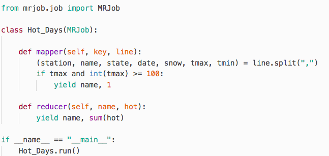

</details>

<details>
  <summary><strong> ✏️ 2.2 Student Do: Snow in Austin (15 mins)</summary></strong>

* In this activity, students use mrjob to list the days in which it snowed in Austin, Texas.

* **File:** [austin_weather_2017.csv](Activities/04-Stu_Austin_Snow/Resources/austin_weather_2017.csv)

* **Instructions:** [README.md](Activities/04-Stu_Austin_Snow/README.md)

</details>

<details>
  <summary><strong> ⭐ 2.3 Review: Snow in Austin (5 mins)</summary></strong>

* Open [snow.py](Activities/04-Stu_Austin_Snow/Solved/snow.py) and walk through the solution line by line.

* You may want to ask for student volunteers to describe each part of the code.

  * In the mapper, split on "," and save to respective variables.

  * The if statement checks for data in the `snow` variable, converts it to a float, and checks to see if the value is over 0.

  * If the value is over 0, the mapper yields the date and 1.

  * The reducer should yield the date and the max from the list of 1s. This way, we produce only one date with a 1. If we used `sum`, we would return all dates with a number representing how many stations recorded snow data on that date.

    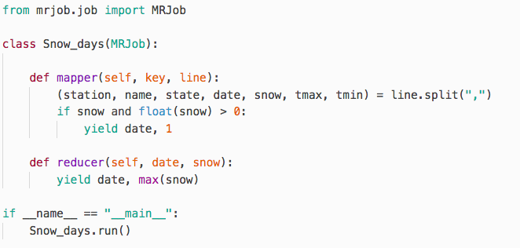

* Go over the bonus solution as well: [bonus.py](Activities/04-Stu_Austin_Snow/Solved/bonus.py).

  * This time, we yield the date and the amount of snow from the mapper.

  * When the reducer yields `max(snow)`, it finds the max amount of snow on that date.

    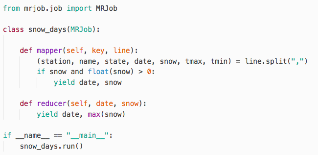

</details>

<details>
  <summary><strong> 📣 2.4 Instructor Do: Spark Overview (Slides 25–38) (10 mins)</strong></summary>

* Help students identify the significant differences between Hadoop (mrjob) and Spark.

* Be sure to mention the following:

  * Hadoop is a buzzword in the big data industry, but many businesses are relying on Spark to solve their big data problems. Spark runs on Hadoop, but it doesn't have to.

  * According to its website, Spark is "a fast and general engine for large-scale data processing."

  * Spark uses scripts from real programming languages, has a rich ecosystem, and is very scalable.

  * Spark uses in-memory computation instead of a disk-based solution, which means it doesn't need to talk to the Hadoop Distributed File System (HDFS) each time and retains as much as it can in memory.

  * Spark uses lazy evaluation, which delays the evaluation of an expression until its value is needed.

</details>

<sub>[Having issues with this activity? Report a bug!](https://bit.ly/2URpsvm)</sub>

- - -

## Break

| Activity Time:       0:15 |  Elapsed Time:      1:35  |
|---------------------------|---------------------------|

- - -

## 3. Demographic DataFrame Basics

| Activity Time:       0:35 |  Elapsed Time:      2:10  |
|---------------------------|---------------------------|

<details>
  <summary><strong> 📣 3.1 Instructor Do: Setup Google Colab (5 mins)</strong></summary>

* Navigate to [Google Colaboratory](https://colab.research.google.com/notebooks/welcome.ipynb). Then explain:

  * That we will use **Cloud-based notebooks** to run spark.

  * Google Colaboratory or Colab are Google-hosted notebooks.

  * These cloud based notebooks allow for easy installation of Spark and the use of cloud computing power.

* Students will need a Google account to use them. If they do not have one already encourage them to sign up for one.

* Once a Google account is set up. Navigate to [Google drive](https://www.google.com/drive/) and select *Go to Google Drive*

  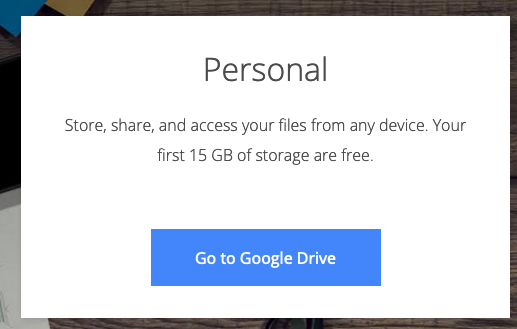

* After you have navigated to Google Drive click the “New” button and select “Folder” to create a new folder. Refer to the following screenshots. Name the folder `DataClassNotebooks`.

  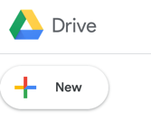

* Navigate to the new folder. Once in the notebook, we’ll need to connect (download) our Google Colab application by following these steps:

  1. Click “New.”
  2. Scroll down to “More” and expand the dropdown menu.
  3. At the bottom of the menu, click “Connect more apps.”

  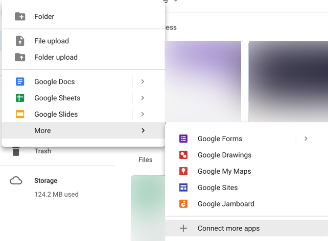

  4. Type “colab” in the top-right search field and press Enter to search for the Colaboratory application.

  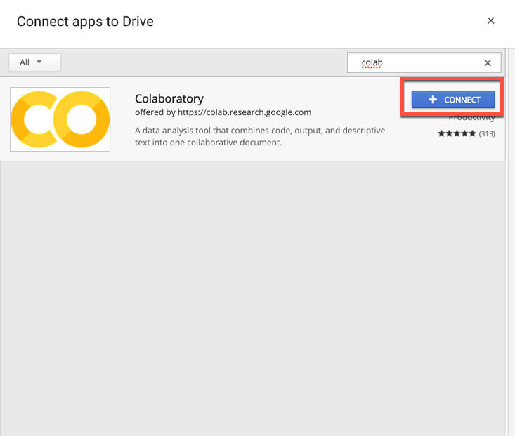

  5. Click the “Connect” button to download the Colaboratory application.

* Create a Colab Notebook by clicking “New” followed by “More,” and then selecting “Colaboratory.”

  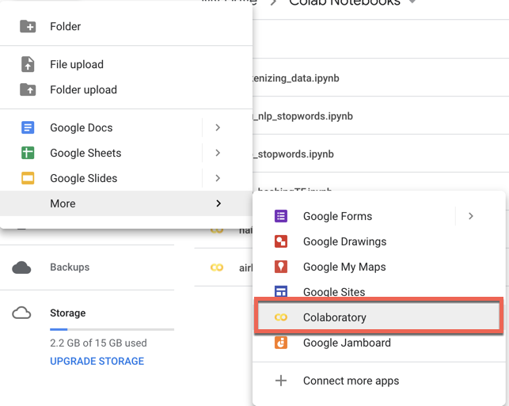

* A new tab will launch with a new notebook. The functionality is very similar to using Jupyter Notebook, except now everything is hosted online.

* Notebooks can be uploaded directly to Colab. Follow the steps to upload the [spark_dataframe_basics.ipnyb](Activities/05-Ins_Pyspark_DataFrames_Basics/Solved/spark_dataframe_basics.ipynb) file.

  1. From the Colab notebook you just opened, click **File** then **Upload Notebook**.

  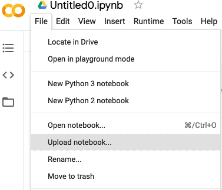

  2. Drag the `spark_dataframe_basics.ipnyb` file into the box to upload.


* **Note** when you upload notebooks the location in Google Drive will default to a folder called **Colab Notebooks**. These files can easily be moved to the `DataClassNotebooks` folder created earlier.

</details>

<details>
  <summary><strong> 📣 3.2 Instructor Do: PySpark DataFrame Basics (10 mins)</strong></summary>

* Open [spark_dataframe_basics.ipnyb](Activities/05-Ins_Pyspark_DataFrames_Basics/Solved/spark_dataframe_basics.ipynb) in Colab.

* Explain that when using Colab each notebook will need to install Spark and create a SparkSession. Start by explaining the first two code blocks:

  * The first block of code may seem scary but all this is doing is installing Spark into our Colab environment. This only takes a few seconds to install but saves the hassle of configuring spark locally.

  * **Note** that Spark is constantly being update and version used in the code below may be outdated. If you run into an issue with installing spark visit the [spark distribution](http://www-us.apache.org/dist/spark/) and to find the most current version of spark 2.X.X and update the version in the variable below. You will need to update this for all notebooks.

  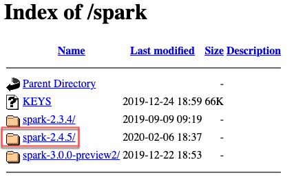

  

  * A spark session is a way for to to control your Spark Application. Before interacting with Spark a session is started and the app is named, this could be any name but usually good to associate the app with what you are doing.

  ```python
  # Start Spark session
  from pyspark.sql import SparkSession
  spark = SparkSession.builder.appName("DataFrameBasics").getOrCreate()
  ```

  * Remind students that these two blocks of code will need to be run with every new notebook that will use Spark. The only thing that will change will be the app name.

* Now that Spark has been installed in the notebook and a session started continue to explain the rest of the code:

  * Spark can create DataFrames manually.

  ```python
  # Create DataFrame manually
  dataframe = spark.createDataFrame([
                                    (0, "Here is our DataFrame"),
                                    (1, "We are making one from scratch"),
                                    (2, "This will look ver similar to a Pandas DataFrame")
  ], ["id", "words"])

  dataframe.show()
  ```

  * Colab can also read  datasets directly from the cloud rather than from local files. In this code block, Colab will pull data from Amazon's Simple Storage Service (S3). This boilerplate code can be used to read other public files hosted on Amazon's services.

  ```python
  # Read in data from S3 Buckets
  from pyspark import SparkFiles
  url = "https://s3.amazonaws.com/dataviz-curriculum/day_1/food.csv"
  spark.sparkContext.addFile(url)
  df = spark.read.csv(SparkFiles.get("food.csv"), sep=",", header=True)
  ```

  * Similar to Pandas, Spark has a mechanism for reading data and storing it as a DataFrame.

  * Conceptually, Spark DataFrames are similar to Pandas DataFrames, but with Spark, the data is distributed.

  * Spark DataFrames organize data in a column and row format in which each column represents a variable, and each row represents a data point.

  * Spark DataFrames take in data from a variety of sources, apply transformations, and collect and display data.

  * When loading JSON data, the schema may not always be correct, so Spark allows importing types and manually setting the schema.

  * Data access and manipulation in Spark are very similar to Pandas.

  * `StructField` takes in the column's name, defines the data type, and takes in a Boolean. This is necessary because JSON files need to have the schema manually set.

  * Spark uses the .`show()` method to display the data from DataFrames.

  * Spark can access the DataFrame in many different ways.

  * Columns can be manipulated using the `withColumn()` method.

  * Columns can be renamed using `withColumnRenamed()`.

  * A list can be made out of columns with `.collect()`.

  * Use `toPandas()` to convert a PySpark DataFrame to a Pandas DataFrame. This should only be done for summarized or aggregated subsets of the original Spark DataFrame.

* Send out the [PySpark documentation](http://spark.apache.org/docs/latest/api/python/index.html).

</details>

<details>
  <summary><strong> ✏️ 3.3 Student Do: Demographic DataFrame Basics (15 mins)</strong></summary>

In this activity, students will use the basics of PySpark DataFrames to analyze a demographic CSV.

* **Files:**

  * [demographics.ipynb](Activities/06-Stu_Pyspark_DataFrames_Basics/Unsolved/demographics.ipynb)

  * [demographics.csv](Activities/06-Stu_Pyspark_DataFrames_Basics/Resources/demographics.csv)

* **Instructions**: [README.md](Activities/06-Stu_Pyspark_DataFrames_Basics/README.md)

</details>

<details>
  <summary><strong> ⭐ 3.4 Review: Demographic DataFrame Basics (5 mins)</strong></summary>

* Import [demographics.ipynb](Activities/06-Stu_Pyspark_DataFrames_Basics/Solved/demographics.ipynb) into Colab and go over the code.

* Be sure to explain the following:

  * Spark is installed and a Spark session is started.

  * A url to the data is stored in a variable.

  * Spark adds the file with `spark.sparkContext.addFile(url)`.

  * Use Spark to read in the data which separates by commas and takes the header.

  ```python
  spark.read.csv(SparkFiles.get("demographics.csv"), sep=",", header=True)
  ```

  * Use `df.columns` to see the list of column names.

  * A summary of the DataFrame columns using `.show()` is similar to using the `.head()` method in Pandas.

  * Use `describe()` and `printSchema()` to show the schema.

  * Show that we can select specific columns to `describe`.

    

  * Show that the `Salary` column can be renamed using `withColumnRenamed`.

  * Show that a new `Salary` column can be added that multiplies each `Salary (1k)` column by 1,000.

    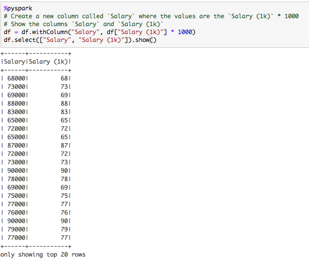

</details>

<sub>[Having issues with this activity? Report a bug!](https://bit.ly/2RjUNVq)</sub>

## 4. PySpark Demographic Filtering

| Activity Time:       0:25 |  Elapsed Time:      2:35  |
|---------------------------|---------------------------|

<details>
  <summary><strong> 📣 4.1 Instructor Do: PySpark DataFrame Filtering (5 mins)</strong></summary>

* Import [spark_filtering.ipynb](Activities/07-Ins_Pyspark_DataFrames_Filtering/Solved/spark_filtering.ipynb) into Colab and run the file.

* Explain the following:

  * Spark can order DataFrames by using the `orderBy()` method.

  * Passing in the column name and either `asc()` for ascending order or `desc()` for descending order.

  ```python
  # Order a DataFrame by ascending values
  df.orderBy(df["points"].asc()).show(5)

  # Order a DataFrame by descending values
  df.orderBy(df["points"].desc()).show(5)
  ```

  * Spark can import other helper functions such as `avg()` which find the average of the column passed to it.

  ```python
  # Import average function
  from pyspark.sql.functions import avg
  df.select(avg("points")).show()
  ```

  * The `filter()` method allows more data manipulation, similar to SQL's `WHERE` clause. Here, it is filtering for all wine that has a price of less than $20.

  ```python
  # Using filter
  df.filter("price<20").show()
  ```

  * The exact columns can be used by combining the `select` method with `filter`.

  ```python
  # Filter by price on certain columns
  df.filter("price<20").select(['points','country', 'winery','price']).show()
  ```

  * Similar to Pandas, Spark can compare multiple conditions using Python operators.

</details>

<details>
  <summary><strong> ✏️ 4.2 Student Do: PySpark Demographic Filtering (15 mins)</strong></summary>
* In this activity, students will use the PySpark filtering functions to filter through the demographic dataset.

* **Files:**

  * [demographics_filtered.ipynb](Activities/08-Stu_Pyspark_DataFrames_Filtering/Unsolved/demographics_filtered.ipynb)

  * [demographics.csv](Activities/08-Stu_Pyspark_DataFrames_Filtering/Resources/demographics.csv)

* **Instructions:** [README.md](Activities/08-Stu_Pyspark_DataFrames_Filtering/README.md)

</details>

<details>
  <summary><strong> ⭐ 4.3 Review: PySpark Demographic Filtering (5 mins)</strong></summary>

* Import [demographics_filtered.ipynb](Activities/08-Stu_Pyspark_DataFrames_Filtering/Solved/demographics_filtered.ipynb) into Colab and go over the code.

* Be sure to review the following:

  * Use the `orderBy` method with `desc` to show the occupations and salaries in descending order.

  * We can leave out `desc` to get the values in ascending order.

  * We can import functions such as `mean` and apply them to our columns. This creates an aggregate view called `avg(Salary)`.

  * We can apply `min` and `max` functions to the Salary column.

  * We can use a filter to show all occupations with salaries greater than 80k.

    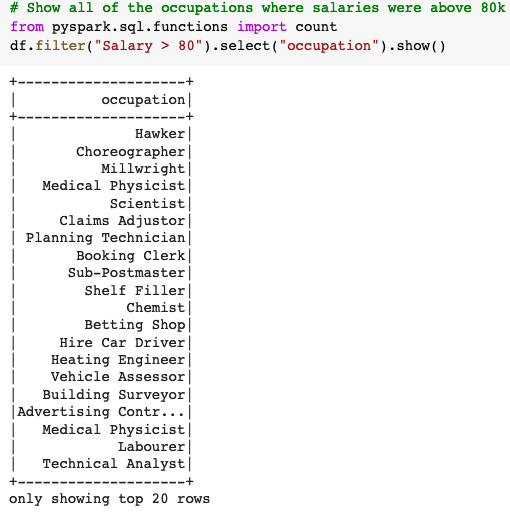

  * We can use `groupBy` with an aggregation function to show the average age and height by academic degree type.

    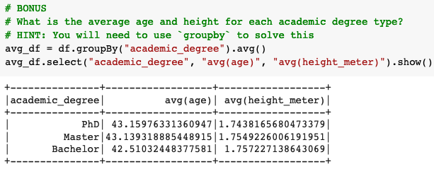

</details>

<sub>[Having issues with this activity? Report a bug!](https://bit.ly/2K1TaHX)</sub>

## 5. Plotting Bigfoot

| Activity Time:       0:25 |  Elapsed Time:      3:00  |
|---------------------------|---------------------------|

<details>
  <summary><strong> 📣 5.1 Instructor Do: PySpark DataFrame Dates (5 mins)</strong></summary>

* Import [spark_dates.ipynb](Activities/09-Ins_Pyspark_DataFrames_Dates/Solved/spark_dates.ipynb) into Colab.

* Walk students through the code and cover the following:

  * To avoid errors in reading the data `inferSchema=True, timestampFormat="yyyy/MM/dd HH:mm:ss"` is used to tell Spark to infer the schema and use this format for handling timestamps.

  * It's common to encounter a variety of date and timestamp formats. Spark provides a functions library with date and timestamp conversion functions.

  * The `year` function is imported and allows to to select the year from a timestamp column.

  ```python
  # Import date time functions
  from pyspark.sql.functions import year

  # Show the year for the date column
  df.select(year(df["date"])).show()
  ```

  * A new column can be created that stores only the year.

  ```python
  # Save the year as a new column
  df = df.withColumn("year", year(df['date']))
  df.show()
  ```

  * With the new column we can now group by the year and find the average precipitation.

  ```python
  # Find the average precipitation per year
  averages = df.groupBy("year").avg()
  averages.orderBy("year").select("year", "avg(prcp)").show()
  ```

  * The same can be done with the month function except using the `max()` function this time.

  * The DataFrame can also be exported to a Pandas DataFrame.

  ```python
  # Import the summarized data to a pandas dataframe for plotting
  # Note: If your summarized data is still too big for your local memory then your notebook may crash

  pandas_df = averages.orderBy("month").select("month", "max(prcp)").toPandas()
  pandas_df.head()
  ```

  * From the Pandas DataFrame we can use matplotlib to chart the data.

  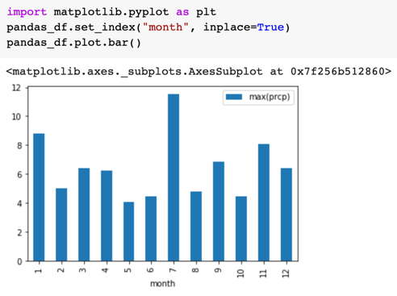

  * Demonstrate the different methods that are part of the date and time PySpark functions.

</details>

<details>
  <summary><strong> ✏️ 5.2 Student Do: Plotting Bigfoot (15 mins)</strong></summary>

In this activity, students will use PySpark and Pandas to clean a Bigfoot dataset and create a plot.

* **Files**

  * [bigfoot.ipynb](Activities/10-Stu_Pyspark_DataFrames_Dates/Unsolved/bigfoot.ipynb)

* **Instructions**

  * [README.md](Activities/10-Stu_Pyspark_DataFrames_Dates/README.md)

</details>

<details>
  <summary><strong> ⭐ 5.3 Review: Plotting Bigfoot (5 mins)</strong></summary>

* Import [bigfoot.ipynb](Activities/10-Stu_Pyspark_DataFrames_Dates/Solved/bigfoot.ipynb) into Colab.

* Walk students through the code and cover the following:

  * Import the functions needed to handle the year-date conversion.

  * Create a new DataFrame with only the year, using the `withColumn` method and the `year` function.

  ```python
  # Create a new DataFrame with the column Year
  df.select(year(df["timestamp"])).show()
  ```

  * Show how the `year` function can be used to create a new Year column from the timestamp. This Year column can then be used to group, count, and order sightings per year.

  * Take the aggregated data and convert it to a Pandas DataFrame for visualization.

    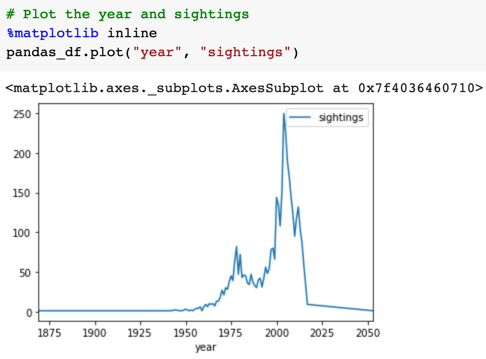

</details>

<sub>[Having issues with this activity? Report a bug!](https://bit.ly/3aUSnnS)</sub>

- - -

## End Class

- - -

## References

Groningen, Martijn van. (2009). "Introduction to Hadoop." Accompanying dataset. [https://blog.trifork.com/2009/08/04/introduction-to-hadoop/](https://blog.trifork.com/2009/08/04/introduction-to-hadoop/)

NOAA National Centers for Environmental information (2018). Climate Data Online. [https://www.ncdc.noaa.gov/cdo-web/datasets/NORMAL_DLY/locations/CITY:US480005/detail](https://www.ncdc.noaa.gov/cdo-web/datasets/NORMAL_DLY/locations/CITY:US480005/detail)

Mockaroo, LLC. (2021). Realistic Data Generator. [https://www.mockaroo.com/](https://www.mockaroo.com/)

- - -

## Copyright

© 2021 Trilogy Education Services, LLC, a 2U, Inc. brand. Confidential and Proprietary. All Rights Reserved.
